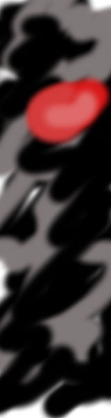
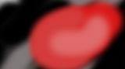

picreaper
=========
Takes images, resizes them and then crops them by hacking off pieces with the least entropy
until desired aspect ratio is reached.

usage
-----
`$ groovy picreaper [imagename]`

example result
--------------

